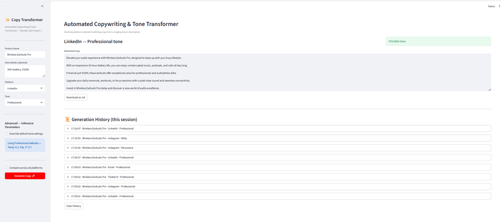

# Automated Copywriting & Tone Transformer



Built during Generative AI Internship at Decode Labs - Project 2.

## What it does

Takes a raw product description and automatically generates professional marketing copy tailored to different platforms and tones, using dynamic prompt compilation and inference parameter tuning.

## Live Demo Features

- **Dynamic prompt templates** - compiles Product, Platform, and Tone into a structured master prompt using Python f-strings
- **Tone-to-parameter mapping** - automatically adjusts Temperature and Top_P based on selected tone (Professional - 0.3, Witty - 0.9)
- **Manual override** - sliders to manually control Temperature and Top_P for experimentation
- **Platform-specific constraints** - enforces character limits and formatting rules per platform (Twitter/X 280 chars, Instagram hashtags, LinkedIn structure, Email format)
- **Compare mode**- generates the same product copy across all 4 platforms simultaneously
- **Live character count validation** — flags copy that exceeds platform limits in real time
- **Session history** - tracks every generation with timestamp, downloadable as .txt
- **Streamlit web UI** - fully interactive, no command line needed

## Tech Stack

Python, Streamlit, Groq API, LLaMA 3.3 70B

## Key Concepts Implemented

- Dynamic prompt template compilation (f-strings)
- Inference parameter tuning (Temperature, Top_P)
- Platform-aware constraint validation
- Session state management for history

## How to run

```
pip install streamlit groq
streamlit run app.py
```

Add your Groq API key in `app.py` before running (get one free at console.groq.com).

## Example

**Input:** Product: "Wireless Earbuds Pro", Platform: Instagram, Tone: Witty

**Output:** A short, punchy caption with emojis and hashtags, generated at temperature 0.9 for maximum creative variance.
